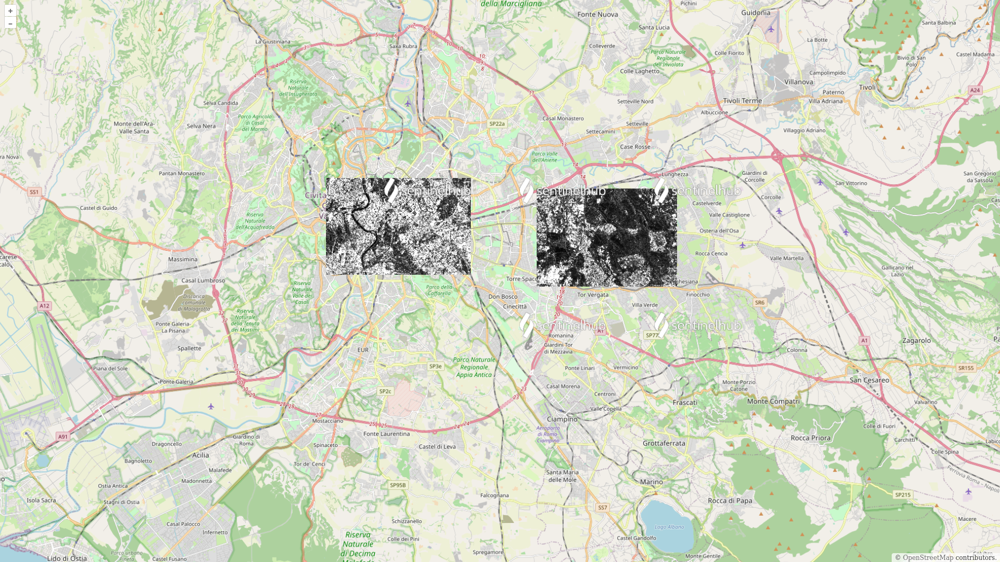

# OpenLayers + Sentinel Hub WMS

Created by following instructions at https://openlayers.org/doc/quickstart.html (original `readme.md` file was renamed to [`original-ol-readme.md`](./original-ol-readme.md))

This example demonstrates the use of Sentinel Hub WMS with OpenLayers.

It contains 2 examples of how to limit the spatial extent of the data
- using `extent` parameter for `TileLayer` (`shLayer1` in [`main.js`](./main.js))
- using `geometry` parameter for Sentinel Hub WMS request (`shLayer2` in [`main.js`](./main.js)) 

When zoomed to Rome, the map should display 2 rectangles with your data.

Example image:

## Development
- run `npm install`
- run `npm run start`
- set correct **instance id** and **layer id** in `main.js`
